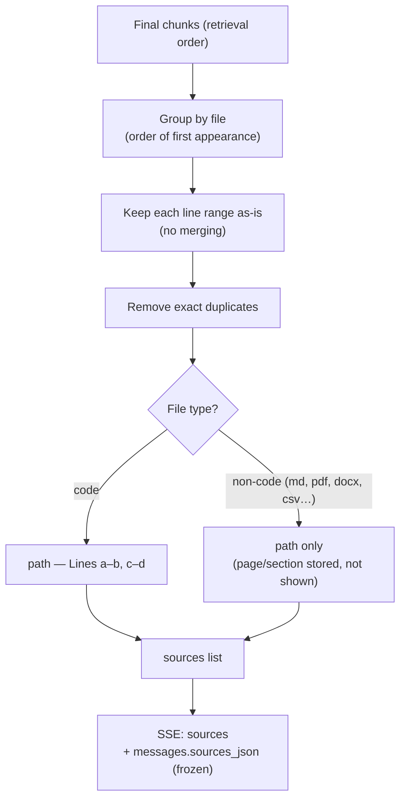
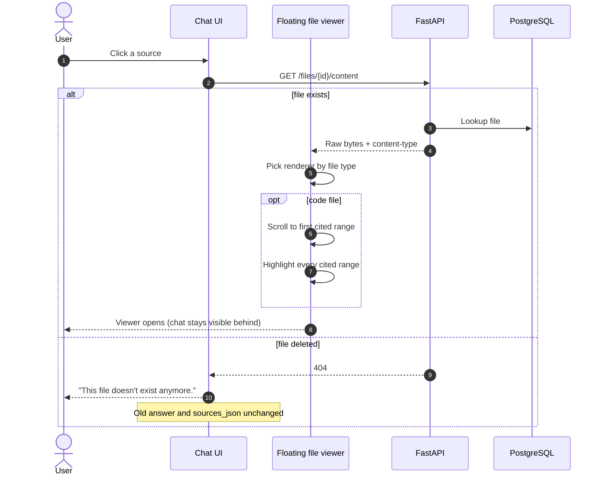

# 08 — Citation Build & Click-Through

How sources are built, frozen and opened. Source: Plan → Backend Behaviour §7; Phase 8.

## Citation builder (pure function)

```mermaid
flowchart TD
    In["Final chunks (retrieval order)"] --> G["Group by file<br/>(order of first appearance)"]
    G --> Keep["Keep each line range as-is<br/>(no merging)"]
    Keep --> Dd["Remove exact duplicates"]
    Dd --> T{"File type?"}
    T -- code --> C["path — Lines a–b, c–d"]
    T -- "non-code (md, pdf, docx, csv…)" --> N["path only<br/>(page/section stored, not shown)"]
    C --> Out["sources list"]
    N --> Out
    Out --> Save["SSE: sources<br/>+ messages.sources_json (frozen)"]
```

## Click-through

```mermaid
sequenceDiagram
    autonumber
    actor U as User
    participant FE as Chat UI
    participant V as Floating file viewer
    participant API as FastAPI
    participant DB as PostgreSQL

    U->>FE: Click a source
    FE->>API: GET /files/{id}/content
    alt file exists
        API->>DB: Lookup file
        API-->>V: Raw bytes + content-type
        V->>V: Pick renderer by file type
        opt code file
            V->>V: Scroll to first cited range
            V->>V: Highlight every cited range
        end
        V-->>U: Viewer opens (chat stays visible behind)
    else file deleted
        API-->>FE: 404
        FE-->>U: "This file doesn't exist anymore."
        Note over FE: Old answer and sources_json unchanged
    end
```
