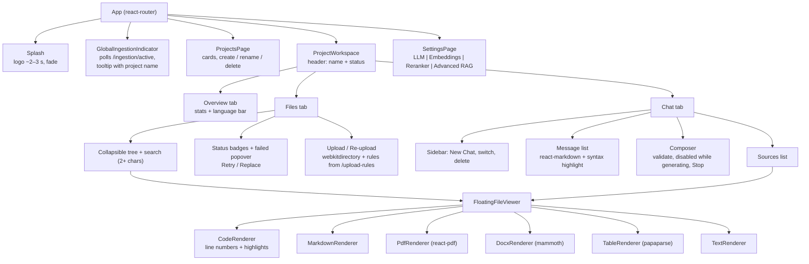
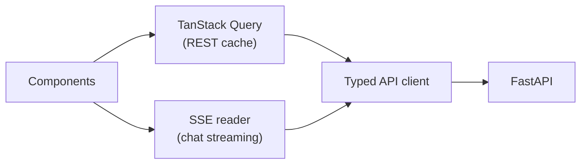
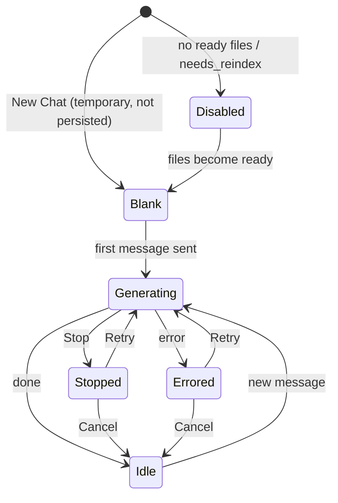

# 13 — Frontend Structure

Source: Plan → Frontend and Repository Layout.

## Routing and layout

```mermaid
flowchart TD
    App["App (react-router)"] --> Splash["Splash<br/>logo ~2–3 s, fade"]
    App --> GI["GlobalIngestionIndicator<br/>polls /ingestion/active,<br/>tooltip with project name"]
    App --> PP["ProjectsPage<br/>cards, create / rename / delete"]
    App --> PW["ProjectWorkspace<br/>header: name + status"]
    App --> SP["SettingsPage<br/>LLM | Embeddings | Reranker | Advanced RAG"]

    PW --> OV["Overview tab<br/>stats + language bar"]
    PW --> FT["Files tab"]
    PW --> CH["Chat tab"]

    FT --> Tree["Collapsible tree + search (2+ chars)"]
    FT --> Badge["Status badges + failed popover<br/>Retry / Replace"]
    FT --> Up["Upload / Re-upload<br/>webkitdirectory + rules from /upload-rules"]

    CH --> Side["Sidebar: New Chat, switch, delete"]
    CH --> Msgs["Message list<br/>react-markdown + syntax highlight"]
    CH --> Comp["Composer<br/>validate, disabled while generating, Stop"]
    CH --> Src["Sources list"]

    Src --> FV
    Tree --> FV
    FV["FloatingFileViewer"] --> Code["CodeRenderer<br/>line numbers + highlights"]
    FV --> Md["MarkdownRenderer"]
    FV --> Pdf["PdfRenderer (react-pdf)"]
    FV --> Docx["DocxRenderer (mammoth)"]
    FV --> Tbl["TableRenderer (papaparse)"]
    FV --> Txt["TextRenderer"]
```

## Data flow

```mermaid
flowchart LR
    Comp["Components"] --> TQ["TanStack Query<br/>(REST cache)"]
    Comp --> SSE["SSE reader<br/>(chat streaming)"]
    TQ --> Client["Typed API client"]
    SSE --> Client
    Client --> BE["FastAPI"]
```

## Chat tab states

```mermaid
stateDiagram-v2
    [*] --> Blank : New Chat (temporary, not persisted)
    Blank --> Generating : first message sent
    Generating --> Idle : done
    Generating --> Stopped : Stop
    Generating --> Errored : error
    Stopped --> Generating : Retry
    Errored --> Generating : Retry
    Stopped --> Idle : Cancel
    Errored --> Idle : Cancel
    Idle --> Generating : new message
    [*] --> Disabled : no ready files / needs_reindex
    Disabled --> Blank : files become ready
```
